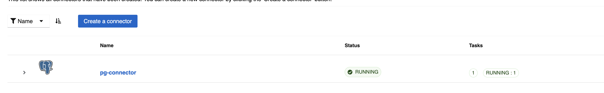
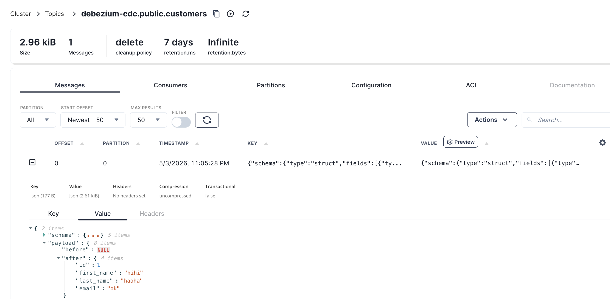

# CDC
- https://debezium.io/documentation/reference/stable/connectors/postgresql.html
- https://docs.redpanda.com/redpanda-labs/docker-compose/cdc-postgres-json/

## Setup

```shell
docker compose up -d
```

## Check wal_level

```sql
SHOW wal_level;
```

## Create connector

```shell
curl -X POST http://localhost:8083/connectors \
  -H "Content-Type: application/json" \
  -d '{
    "name": "pg-connector",
    "config": {
      "connector.class": "io.debezium.connector.postgresql.PostgresConnector",
      "database.hostname": "postgres",
      "database.port": "5432",
      "database.user": "username",
      "database.password": "password",
      "database.dbname": "debezium",
      "topic.prefix": "debezium-cdc",
      "table.include.list": "public.customers",
      "plugin.name": "pgoutput",
      "slot.name": "debezium_slot",
      "publication.autocreate.mode": "filtered"
    }
  }'
```



## Check status

```shell
curl http://localhost:8083/connectors/pg-connector/status
```

## Insert data

Execute this command in postgresql
```sql
INSERT INTO public.customers
(id, first_name, last_name, email)
VALUES(nextval('customers_id_seq'::regclass), 'hihi', 'haaha', 'ok');
```

Then check the event in kafka


## Delete connector

```shell
curl -X DELETE http://localhost:8083/connectors/pg-connector
```
