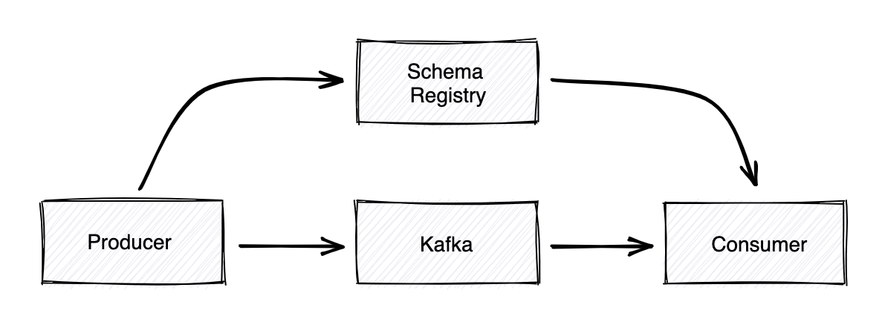
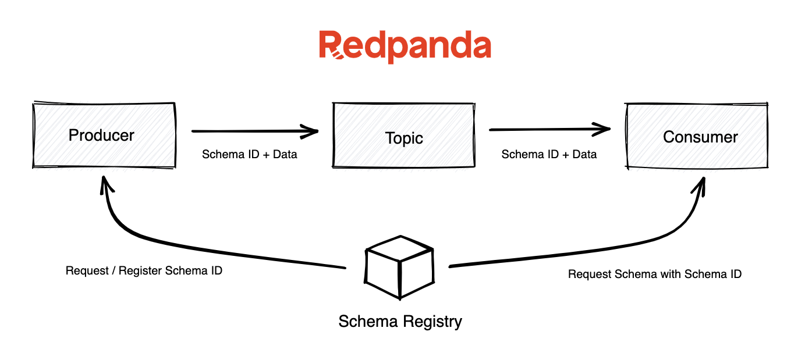

# Schema registry

- https://www.redpanda.com/guides/kafka-tutorial-kafka-schema-registry

## Architecture

When publishing a record, the producer checks if the schema is already registered in the schema registry and pulls up the Schema ID.
It then serializes the data with the schema and sends the unique Schema ID and the data.
It registers and caches it by default if it’s not registered with the schema registry.

On the consumer side, Kafka will consult the schema registry using the Schema ID supplied by the producer to deserialize this message.
If there is a schema mismatch, the producer will be immediately identified for violating the implicit contract.